# Azure Functions Agent Runtime architecture

## 1. Overview

`azure-functions-agents-runtime` turns a markdown-first agent project into an `azure.functions.FunctionApp`. The design goal is that you write `.agent.md` files plus a small amount of supporting configuration, and the runtime translates that authoring format into Azure Functions triggers, HTTP routes, MCP surfaces, and tool wiring. At startup, the runtime follows a three-stage pipeline: **discover** project files and inventories, **translate** them into typed runtime objects, and **register** the resulting agents on a Function App. The authoritative implementation of that pipeline lives in `src/azure_functions_agents/app.py:create_function_app()`.

Agent evaluation is external and cross-cutting rather than a startup pipeline stage. The preview
Vally executor invokes an agent's existing opt-in synchronous chat route under Core Tools or in
staging and translates generic runtime response/tool evidence into a Vally trajectory. Vally owns
stimuli, graders, repeated trials, scores, reports, and CI verdicts. The executor does not discover,
compose, register, or execute agents by a second path (FRD 0010).

One agent can also declare a `subagents:` list so its own model can call other agents as `delegate_<slug>` tools during a normal `agent.run()` — chat-time multi-agent delegation (FRD 0007). That feature layers a small amount of extra structure onto the same pipeline (an app-wide identity index and an immutable, slug-keyed catalog built before any `FunctionApp` mutation) rather than introducing a new one; see Section 5, "Multi-agent delegation (subagents)".

## 2. High-level data flow

```mermaid
flowchart LR
    A["Agent project inputs<br/>*.agent.md / agent.md / CLAUDE.md / *.claude.md<br/>agents.config.yaml<br/>mcp.json<br/>skills/<br/>tools/"] -->|"Path"| B["config/paths.py"]
    B -->|"app_root: Path"| C["config/loader.py<br/>load_global_config<br/>load_agent_specs"]
    A -->|"Path"| D["discovery/*<br/>skills + tools + MCP"]
    C -->|"GlobalConfig + list of AgentSpec"| E["config/merge.py<br/>compose"]
    D -->|"discovered inventories"| E
    E -->|"list of ResolvedAgent"| E2["app.py<br/>identity index<br/>fail-fast on duplicate slugs"]
    E2 -->|"ResolvedAgent + known_slugs"| F["config/validation.py<br/>validate_resolved_agent<br/>validate_subagent_references"]
    F -->|"ResolvedAgent"| G["registration/capabilities.py<br/>build_capabilities"]
    G -->|"AgentCapabilities"| G2["registration/catalog.py<br/>AgentCatalog (immutable)"]
    G2 -->|"complete agent inventory"| W["workflows/integration.py<br/>handler catalog + workflow-agent policy catalog<br/>(immutable)"]
    W -->|"any workflow agent?"| I["FunctionApp or DFApp"]
    W -->|"register Durable runtime once"| I
    G2 -->|"AgentCatalog"| H["registration/triggers.py<br/>registration/endpoints.py"]
    W -->|"workflow-agent policy by slug"| H
    H -->|"Decorators applied"| I
    J["client_manager.py<br/>ClientManager"] -.->|"chat client"| K["runner.py<br/>run_agent<br/>run_agent_stream<br/>build_subagent_tools"]
    H -.->|"handler closures + AgentCatalog"| K
    K -.->|"default: prompt + tools + session"| L["Microsoft Agent Framework"]
    K -.->|"explicit app-level local preview"| P["_copilot.py<br/>Copilot SDK + native stdio"]
    P -.->|"SDK-owned persistence"| S["local native session files"]
```



Read left to right: files on disk become typed config, typed config becomes a
`ResolvedAgent`, and each resolved agent is registered as Azure Functions
bindings plus optional built-in endpoints. Before registration, startup freezes
the complete `AgentCatalog`, complete workflow-handler catalog, and immutable
workflow-agent policy catalog. This makes both delegation and per-agent workflow
authorization independent of file order.

A few boundaries are worth calling out explicitly:

- **Discovery is read-only.** These modules inspect the project tree and return inventories; they do not decide what any one agent is allowed to use.
- **Translation is type-driven.** The loader and merge layers convert loose YAML/markdown input into `AgentSpec`, `GlobalConfig`, and then `ResolvedAgent`.
- **Composition is two-pass and side-effect-free until pass 2.** `app.py` builds
  the slug index and validates references, then
  freezes the `AgentCatalog`, complete workflow-handler catalog, and per-agent
  workflow-policy catalog. Only pass 2 creates/mutates the app, registers the
  workflow runtime once, and registers agent surfaces (FRDs 0004 and 0007).
- **Registration is Azure-specific.** This is the first stage that knows about `azure.functions.FunctionApp`, decorators, routes, and trigger bindings.
- **Execution is deferred.** The runner is not part of startup registration; it is called later by handler closures when an HTTP route or trigger actually fires. The explicit local Copilot opt-in forks before MAF construction; its SDK owns native process startup and local session files.
- **Evaluation remains outside startup.** The Vally executor consumes the registered chat contract;
  Vally owns stimuli, graders, repetitions, reports, and gates. Python runtime modules do not import
  Vally contracts.

## 3. Module map

| Package/module | Role | Key entry points |
| --- | --- | --- |
| `azure_functions_agents/app.py` | Top-level two-pass composition root. Before app mutation it builds the slug index, `AgentCatalog`, complete workflow-handler catalog, and immutable workflow-agent policy catalog. It chooses `DFApp` when any agent enables workflows, registers the workflow runtime once, then registers each agent. | `create_function_app()`, `_fail_on_duplicate_slugs()` |
| `azure_functions_agents/config/paths.py` | Resolves the app root and the optional config/history directory. | `set_app_root()`, `get_app_root()`, `resolve_config_dir()` |
| `azure_functions_agents/config/env.py` | Performs env-var substitution and bool coercion across config string values in YAML, JSON, front matter, and markdown body content. | `substitute_env_vars_in_value()`, `resolve_env_vars_in_data()`, `substitute_env_vars_in_text()`, `_to_bool()` |
| `azure_functions_agents/config/schema.py` | Defines the Pydantic models for raw, global, and merged config, including independent object-only chat and workflow Sub Agent grants. | `AgentSpec`, `GlobalConfig`, `ResolvedAgent`, `TriggerSpec`, `BuiltinEndpointsConfig`, `SubagentRef`, `WorkflowConfig`, `WorkflowSubagentRef` |
| `azure_functions_agents/config/loader.py` | Loads YAML front matter and `agents.config.yaml` into typed models. | `load_agent_specs()`, `load_global_config()` |
| `azure_functions_agents/config/merge.py` | Applies defaults, overrides, and per-agent filters to produce runtime config, including each agent's identity `slug` (via `_slug.py`) and its normalized `subagents` list. | `compose()` |
| `azure_functions_agents/_slug.py` | Derives an agent's identity slug from its `.agent.md` filename (and the `delegate_<slug>` tool-name convention) in one shared place, so naming, config composition, and delegation can never compute a slug differently. | `_function_name_from_source()`, `delegate_tool_name()` |
| `azure_functions_agents/_agent_identity.py` | Derives a deterministic, human-readable MAF agent id from trimmed, lower-case `WEBSITE_SITE_NAME` (or `local`) plus the canonical filename-derived agent slug for telemetry and external registration flows. Identical site and slug inputs produce the same ID; renaming the site changes it, and local projects with the same slug share an ID. | `agent_id()` |
| `azure_functions_agents/_history_identity.py`, `_blob_history.py`, `_file_history.py` | Validate the canonical slug before using it as a path segment and persist conversation history by `(agent_slug, session_id)`. | `validate_agent_slug()`, `BlobHistoryProvider`, `ScopedFileHistoryProvider` |
| `azure_functions_agents/config/validation.py` | Post-merge sanity checks for resolved agents, including rejecting unknown/duplicate/self references in both independent Sub Agent grants against the app-wide slug index. | `validate_resolved_agent()`, `validate_subagent_references()`, `validate_workflow_subagent_references()` |
| `azure_functions_agents/discovery/skills.py` | Walks `skills/<name>/SKILL.md` files, validates frontmatter, and caches the name→directory map for MAF's `SkillsProvider`. | `discover_skills()`, `clear_skills_cache()` |
| `azure_functions_agents/discovery/tools.py` | Imports `tools/*.py`, finds normal `FunctionTool`/plain-function tools, discovers `@workflow_tool` Activity targets, and caches both inventories. | `discover_project_tools()`, `discover_user_tools()` |
| `azure_functions_agents/discovery/mcp.py` | Loads `mcp.json`, applies `resolve_env_vars_in_data()`, and translates remote HTTP server definitions into MAF MCP tool wrappers. | `discover_mcp_servers()` |
| `azure_functions_agents/registration/capabilities.py` | Applies per-agent MCP/skills/tools filters and packages the final runtime inventory; also fails fast when an auto-derived `delegate_<slug>` tool name collides with another tool already on the same agent. A shallow direct-role copy may add runtime-owned skills without mutating the project-only capabilities frozen in the catalog. | `AgentCapabilities`, `build_capabilities()`, `with_runtime_skill_paths()`, `validate_subagent_tool_names()` |
| `azure_functions_agents/registration/catalog.py` | Freezes every agent's `ResolvedAgent` + `AgentCapabilities` into one immutable, slug-keyed `AgentCatalog`, built once at startup and threaded read-only into request handlers (FRD 0007). | `AgentCatalog`, `CatalogEntry`, `build_catalog()` |
| `azure_functions_agents/registration/_naming.py` | Fails fast via `allocate_unique_function_name()` / `allocate_unique_builtin_slug()` when two `.agent.md` files sanitize to the same identity slug — a **breaking change** (FRD 0007 §5 Decision #17) replacing the previous silent auto-suffix behavior; re-exports the `_slug.py` helpers for backward compatibility. | `allocate_unique_function_name()`, `allocate_unique_builtin_slug()` |
| `azure_functions_agents/registration/_handlers.py` | Builds the callable closures that turn incoming trigger data or HTTP bodies into runner prompts, threading the `AgentCatalog` through to the runner and combining tool-error heuristics with explicit delegate-error accounting; delegates non-HTTP binding payloads to the trigger serializer. `make_http_agent_handler()` applies the shared `_auth` Entra guard to the request before any processing when the trigger's `auth` policy is `entra`. | `make_agent_handler()`, `make_http_agent_handler()`, `build_sandbox_tools_for_session()`, `_total_tool_error_count()` |
| `azure_functions_agents/registration/_trigger_serialization.py` | Uses native data contracts and public Azure Functions binding adapters to produce JSON-safe non-HTTP trigger payloads. | `serialize_trigger_data()`, `TriggerBindingSerializer` |
| `azure_functions_agents/registration/triggers.py` | Registers each agent trigger, dispatching between the runtime HTTP adapter and Azure Functions trigger decorators. Resolves an `http_trigger`'s inbound auth (nested `auth`, deprecated flat `auth_level`) into the shared `EndpointAuthConfig` and applies the `_auth` route `AuthLevel`. | `register_agent()` |
| `azure_functions_agents/registration/endpoints.py` | Registers debug chat UI, REST chat, SSE streaming, and MCP tools for agents with built-in endpoints. The synchronous chat and MCP responses expose the effective model plus generic completed-tool evidence used by clients such as the Vally executor. | `register_builtin_endpoints()` |
| `azure_functions_agents/registration/_auth.py` | Enforces inbound endpoint auth: maps the configured `auth.mode` to a Functions `AuthLevel` (API key / anonymous) and enforces Entra ID identity by trusting the platform-validated Easy Auth `x-ms-client-principal` header (never validating tokens in-app), with optional tenant/audience/client-id allowlists. Because `entra` routes are anonymous, the header is trusted only with non-spoofable evidence Easy Auth is enforced (`WEBSITE_AUTH_ENABLED` / `AZURE_FUNCTIONS_AGENTS_ENTRA_EASY_AUTH`); fails closed (401) otherwise. | `resolve_endpoint_auth_level()`, `authorize_entra_request()` |
| `azure_functions_agents/system_tools/sandbox.py` | Builds the ACA Dynamic Sessions-backed `execute_python` tool for a resolved agent/session, using a fresh GUID when no explicit session id is provided. | `create_sandbox_tools()` |
| `azure_functions_agents/system_tools/web_request.py` | Builds the default-on, SSRF-guarded `web_request` outbound HTTP tool, built once per agent at registration (no Azure resource required). | `create_web_request_tools()` |
| `azure_functions_agents/runner.py` | Executes prompts through the default Microsoft Agent Framework path, managing sessions, tools, and streaming; the bounded Copilot fork composes the direct non-streaming host-tool catalog before any MAF construction. Its shared MAF constructor supplies stable IDs and site-qualified readable names without changing canonical slugs. Builds per-request `delegate_<slug>` tools and fresh stateless workflow leaf agents on the MAF path; returns framework-neutral evidence including the effective model, completed tool calls, deterministic model-response batch IDs, and sanitized result success; attempts one internal token-usage record through the shared runtime logger for each actual invocation attempt. | `run_agent()`, `run_agent_stream()`, `build_subagent_tools()`, `run_leaf_agent_task()` |
| `azure_functions_agents/client_manager.py` | Defines the pluggable MAF inference-client abstraction, immutable inference-target metadata, and the default MAF-backed implementation. Its pure internal built-in resolver preserves MAF provider/model precedence without constructing a chat client; an identity check protects Copilot from custom-manager fallback. | `ClientManager`, `InferenceTarget`, `get_client_manager()`, `set_client_manager()` |
| `azure_functions_agents/_harness.py` | Private once-per-app-root harness selection, explicit preview capability validation, and conservative MAF `FunctionTool` qualification, including combined-catalog collision checks and rejection of unsupported configured output caps and custom client managers before app mutation. Captures one frozen Copilot provider from `_copilot_providers.py`; standalone runner calls use the same selection. No SDK import/process side effects when off. | `AppHarness`, `HarnessRequest`, `get_harness()`, `prepare_tools()`, `validate_agent()` |
| `azure_functions_agents/_copilot_providers.py` | Defines the Copilot provider interface, registry, sanitized provider-setting validation, and frozen OpenAI / Azure OpenAI / Foundry SDK provider mappings. Reads only the provider environment at harness selection; imports the Copilot SDK lazily when building per-request config. | `CopilotProvider`, `OpenAIProvider`, `AzureOpenAIProvider`, `FoundryProvider`, `_PROVIDERS` |
| `azure_functions_agents/_copilot.py` | Lazy, pinned local Copilot SDK stdio adapter. Uses SDK-owned runtime acquisition, native session create/resume/disconnect and local state; supplies provider token callbacks, adapts only the host-qualified custom tools, checks their exact model-visible catalog, translates results/usage and stops the SDK client on shutdown. No ambient SDK tools, host completion marker, OS file lock, broad child-environment filter, cache-layout inspection or outbound HTTP rewrite. | `run()`, `shutdown()` |
| `azure_functions_agents/workflows/integration.py` | Builds the complete immutable handler catalog, immutable slug-keyed workflow-agent policy catalog (including allowed tools' decorator-owned retry and timeout declarations), per-agent management tools/addenda, validates declared trigger support for workflow-enabled agents, and performs the one app-wide Durable registration. It also resolves the packaged `data-driven-workflows` skill used for progressive authoring guidance. | `build_workflow_handler_catalog()`, `build_workflow_agent_policy_catalog()`, `build_workflow_agent_integration()`, `data_driven_workflows_skill_path()`, `validate_workflow_agent_trigger()`, `register_workflow_runtime()` |
| `azure_functions_agents/workflows/engine.py` | Registers one Durable blueprint per app and executes the native two-argument Durable Task orchestrator, workflow-tool Activity, and Workflow Sub Agent Activity. Orchestration and Activity schedules attach `durabletask.displayName` tags for readable DTS dashboard timelines without changing registered function names. Capability-bearing Activities reauthorize against the current workflow-agent policy before complete-catalog dispatch. Data-driven execution uses typed persisted-task/state contracts and deterministic phase helpers for `when` evaluation, bounded `for_each` materialization, runnable selection, ordered aggregation, result application, cancellation restoration, structured (`schema_version: 2`) status, and controlled-failure normalization. It selects retry and continuation behavior from persisted orchestration input. Static and dynamic schedulers share the continuation decision that commits bounded permitted failures. Waves without enabled continuation keep the earlier wait, failure, and cancellation order. Durable `yield` boundaries remain in the top-level orchestrator generator. | `register_workflows()` |
| `azure_functions_agents/workflows/context.py` | Tracks invocation context by `(workflow_agent_slug, session_id)`, derives non-revealing 128-bit agent/session prefixes for Durable instance IDs, and exposes the per-delivery task context whose idempotency key is stable across retry attempts. | `session_instance_prefix()`, `new_workflow_instance_id()`, `workflow_matches_agent_session()`, `current_workflow_task_context()` |
| `azure_functions_agents/workflows/activity.py` | Policy-aware Activity execution: strict validation of persisted retry, timeout, and continuation data; per-attempt deadline enforcement; the `ok`/`failure` outcome envelope; and the failure classification that decides whether Durable is asked to retry. Models read back from Durable history ignore unknown keys so a newer history still validates. | `invoke_policy_handler()`, `validate_activity_result()` |
| `azure_functions_agents/workflows/native_retry.py` | Maps the persisted retry policy onto Durable Python 2.x `RetryPolicy`, raises the private marker that asks Durable to retry a sanitized outcome, and decodes that outcome back out of an exhausted `TaskFailedError`. | `create_durable_retry_policy()`, `raise_for_durable_retry()`, `decode_durable_retry_failure()` |
| `azure_functions_agents/workflows/registry.py` | Defines immutable workflow handler entries/catalogs; production app composition passes this complete catalog explicitly rather than using the compatibility singleton allowlist as authorization. | `WorkflowHandlerCatalog`, `build_handler_catalog()` |
| `azure_functions_agents/workflows/schema.py`, `workflows/tools.py` | Define workflow plans and policies, including the data-driven `when` predicate, bounded `for_each`, plan-authored retry, timeout, and continuation, and per-field decorator precedence. Start-time validation freezes the effective execution policy into orchestration input. Continuation stays plan-only. List/status/cancel/terminate operations use the captured workflow-agent policy and agent/session identity. | `WorkflowPlanPolicy`, `WorkflowTaskExecution`, `WorkflowCondition`, `validate_plan()`, `resolve_workflow_task_execution()`, `build_workflow_tools()` |
| `azure_functions_agents/_function_tool.py` | Thin local shim around MAF `FunctionTool` creation so project tools can use `@tool`, plus `@workflow_tool` metadata for Dynamic Workflow Activity targets. | `tool()`, `workflow_tool()` |
| `azure_functions_agents/_logger.py` | Shared package logger used across discovery, registration, and runtime code. | `logger` |
| `azure_functions_agents/_observability.py` | Cross-cutting OpenTelemetry bootstrap and conventions: enables MAF `gen_ai` instrumentation and, when the optional `[monitor]` extra is installed, the Azure Monitor exporter, provides the `af.*` span/attribute helpers (fault domain, lifecycle stage), the resolved sensitive-data flag from `ENABLE_SENSITIVE_DATA`, minimal dynamic-session and delegate-call metrics, and third-party log-noise control. | `configure_observability()`, `start_span()`, `current_span()`, `FaultDomain`, `LifecycleStage`, `record_delegate_call()` |
| `integrations/vally-executor-azure-functions/` | Private, path-loadable Vally 0.16.0 executor for the existing synchronous chat endpoint. It owns anonymous/key/Entra target authentication, isolated sessions, hard deadlines, response-contract checking, and trajectory conversion—not graders, scoring, or reports. | `AzureFunctionsAgentExecutor`, `registerExecutors()` |

### How the packages line up

- `config/` answers **"what did the author write?"**
- `discovery/` answers **"what is available in this project folder?"**
- `app.py`'s composition root answers **"is this configuration internally consistent app-wide?"** (unique slugs, valid `subagents:` references) — the one cross-agent question no single `ResolvedAgent` can answer by itself.
- `registration/` answers **"which Azure Functions surfaces should exist for this agent?"**
- `system_tools/` answers **"which runtime-provided tools can be attached on demand?"**
- `runner.py` and `client_manager.py` answer **"once invoked, how does an agent call the model and its tools — including any specialist it delegates to?"**
- `_observability.py` (cross-cutting) answers **"what did the run do, and is a failure the app's, runtime's, platform's, or a delegated specialist's fault?"**
- `integrations/vally-executor-azure-functions/` (external tooling) answers **"how can Vally evaluate authored behavior through the same hosted chat surface?"**

### Typical startup trace

When the host imports your app module and calls `create_function_app()`, control usually moves through the codebase in this order:

1. `app.py` resolves the project root.
   `_harness.get_harness()` freezes the app-level preview choice here, before
   discovery or telemetry bootstrap. It does not launch a native process.
2. `config/loader.py` reads `agents.config.yaml`.
3. `app.py` calls `_observability.configure_observability()`: when an Application Insights connection string is present, this bootstraps OpenTelemetry export + instrumentation once if the optional `[monitor]` exporter is available and no provider is already active; otherwise the runtime uses an already-active provider or no-ops.
4. `config/loader.py` reads every agent markdown file (`*.agent.md`, bare `agent.md`/`CLAUDE.md`, and `*.claude.md`) and creates `AgentSpec` values.
5. `discovery/tools.py`, `discovery/mcp.py`, and `discovery/skills.py` build the shared inventories for the project.
6. `config/merge.py` turns each `AgentSpec` plus `GlobalConfig` into one `ResolvedAgent`, computing its identity `slug` via `_slug.py`.
7. `app.py`'s `_fail_on_duplicate_slugs()` builds the app-wide slug index and fails fast on collisions; `config/validation.py:validate_subagent_references()` then rejects unknown/duplicate/self `subagents:` references against that index.
8. `config/validation.py:validate_resolved_agent()` checks each merged object for missing triggers, bad MCP references, and similar config mistakes (an agent referenced only as a `subagents:` target is exempt from the trigger-or-`builtin_endpoints` requirement).
9. `registration/capabilities.py` converts name-based filters into concrete tool lists and skill paths, and fails fast on any `delegate_<slug>` tool-name collision.
10. `registration/catalog.py:build_catalog()` freezes every agent's
    `ResolvedAgent` + `AgentCapabilities`. `workflows/integration.py` then builds
    the complete immutable workflow-handler catalog and one immutable
    `WorkflowPlanPolicy` per workflow-enabled agent.
11. `app.py` creates a `DFApp` when the workflow-agent policy catalog is non-empty
    (otherwise a plain `FunctionApp`) and registers the app-wide Durable runtime
    exactly once.
12. `registration/triggers.py` and `registration/endpoints.py` register every
    agent, looking up workflow policy by workflow-agent slug and threading the catalogs
    into handler closures.

That ordering matters because registration does not re-parse YAML or front
matter; it trusts typed resolved values and immutable catalogs. Steps 6-10 are
pass 1 and side-effect-free. Steps 11-12 are pass 2 and own all Azure Functions
mutation.

## 4. Pipeline stages

The `create_function_app()` docstring in `src/azure_functions_agents/app.py:create_function_app()` is the source of truth. The steps below restate it in module terms.

1. **Resolve app root**
   - **Implemented by:** `src/azure_functions_agents/app.py:create_function_app()`, `src/azure_functions_agents/config/paths.py`
   - **Input:** optional `app_root: Path | None` plus environment variables such as `AZURE_FUNCTIONS_AGENTS_APP_ROOT` and `AzureWebJobsScriptRoot`
   - **Output:** `resolved_root: Path`
   - **Notes:** this is the root path handed to every later loader/discovery function. `app.py` also calls `_allow_skill_reads()` immediately afterwards so built-in file readers can safely access the project's `skills/` directory.

2. **Load global `agents.config.yaml`**
   - **Implemented by:** `src/azure_functions_agents/config/loader.py:load_global_config()`
   - **Input:** `app_root: Path`
   - **Output:** `GlobalConfig`
    - **Notes:** missing config is valid and becomes `GlobalConfig()`. String values in `agents.config.yaml` are normalized through `config/env.py` via `resolve_env_vars_in_data()`, so env-var references are resolved before the Pydantic model is materialized.

3. **Load all agent markdown files**
   - **Implemented by:** `src/azure_functions_agents/config/loader.py:_load_agent_spec()`, `src/azure_functions_agents/config/loader.py:load_agent_specs()`
   - **Input:** `app_root: Path`
   - **Output:** `list[AgentSpec]`
   - **Notes:** the loader searches for agent markdown files in two locations: the app root and an optional `agents/` folder (`{app_root}/agents/`). The folder name is case-insensitive (`agents/` or `Agents/`). Within each location the loader collects three filename shapes: (1) `*.agent.md` with a non-empty prefix (e.g. `report.agent.md`); (2) `*.claude.md` with a non-empty prefix (e.g. `report.claude.md`), which is normalized to `*.agent.md` internally; (3) bare `agent.md` or `CLAUDE.md` (case-insensitive), which are aliases for `main.agent.md` internally (producing slug `main`). All suffix matching (`.agent.md`, `.claude.md`) is case-insensitive. Only the singular `.agent.md` and `.claude.md` suffixes are recognised; `*.agents.md` (plural) is **not** a supported pattern and files with that suffix are silently ignored by the loader. Files from all locations are combined and sorted by path for deterministic ordering. Each file is parsed as YAML front matter plus markdown body. When substitution is enabled, front matter string values are normalized through `resolve_env_vars_in_data()` and the markdown body through `substitute_env_vars_in_text()`. The loader stamps `source_file` with the real on-disk path, sets `is_main` when the normalized filename is `main.agent.md` (regardless of location), and stores the markdown body in `AgentSpec.instructions`. Because `agent.md` and `CLAUDE.md` are aliases for `main.agent.md`, they produce the same slug and must not coexist anywhere in the same app — both derive slug `main`, slug uniqueness is enforced app-wide and step 6 (`_fail_on_duplicate_slugs()`) will reject such a configuration.

4. **Discover runtime inventories from disk**
   - **Implemented by:** `src/azure_functions_agents/app.py:create_function_app()`, `src/azure_functions_agents/discovery/tools.py:discover_project_tools()`, `src/azure_functions_agents/discovery/mcp.py:discover_mcp_servers()`, `src/azure_functions_agents/discovery/skills.py:discover_skills()`
   - **Input:** `app_root: Path`
   - **Output:** project tools as normal user tools (`list[FunctionTool]`) plus workflow tools (`list[WorkflowTool]`), MCP servers as `dict[str, MCPTool]`, skills as `dict[str, Path]` (skill name → skill directory)
   - **Notes:** all three discovery modules cache by resolved app root, so startup pays the disk/import cost once per process. Tools discovery remains read-only policy-wise: it records what `tools/` exposes as normal tools and what callables explicitly opt into workflow Activity execution via `@workflow_tool`, but per-agent filtering happens later. MCP discovery applies the same env-var substitution helper (`resolve_env_vars_in_data()`) to parsed `mcp.json` data that the global-config loader applies to `agents.config.yaml`. MCP discovery is a translation step too: entries are built into ready-to-use MAF MCP tool objects when they carry a `url`; `type` is optional, but if present must be `"http"` or `"streamable-http"`. Other transport shapes (`stdio`, `sse`, etc.) and entries missing `url` are skipped with warnings. Skill discovery validates each project `SKILL.md` frontmatter `name` against MAF's regex and fails fast on duplicates. `data-driven-workflows` is reserved for the runtime-owned workflow authoring skill and is rejected if discovered in the project inventory.

5. **Compose a per-agent runtime view**
   - **Implemented by:** `src/azure_functions_agents/config/merge.py:compose()`
   - **Input:** `AgentSpec`, `GlobalConfig`, `discovered_mcp_names: list[str]`, `discovered_skill_names: list[str]`
   - **Output:** `ResolvedAgent`
   - **Notes:** this is where startup-level precedence rules are applied. Timeout resolves from agent front matter, global config, `AZURE_FUNCTIONS_AGENTS_TIMEOUT_SECONDS`, and then the 900-second default. Model resolves from agent front matter, global config, or `AZURE_FUNCTIONS_AGENTS_MODEL`; if registration does not request a model, the active `ClientManager` later falls back to provider-specific env (`AZURE_OPENAI_DEPLOYMENT` for Azure OpenAI, `FOUNDRY_MODEL` for Microsoft Foundry) and then the provider default. Capability filters turn the global/shared inventories into per-agent allow/deny decisions. `ResolvedAgent.slug` (the agent's identity, derived from its source filename via `_slug.py`) and `ResolvedAgent.subagents` (its normalized `list[SubagentRef]`) are also produced here — both are load-bearing for the multi-agent delegation stages below (FRD 0007).

6. **Build the app-wide identity index; validate `subagents:` references**
   - **Implemented by:** `src/azure_functions_agents/app.py:_fail_on_duplicate_slugs()`, `src/azure_functions_agents/config/validation.py:validate_subagent_references()`
   - **Input:** `list[ResolvedAgent]`
   - **Output:** `known_slugs: set[str]` (every agent's identity slug, verified collision-free) and, per agent, a validated `subagents` list
   - **Notes:** this is FRD 0007 §4.2's "two-pass composition" pass 1a — the first cross-agent check, and it must run before any other per-agent validation. A slug doubles as the registered Azure Function name, the `/agents/<slug>/` built-in endpoint route, and the `delegate_<slug>` tool name other agents use to reach it, so two source files that sanitize to the same slug now **fail startup** with an actionable rename error instead of silently registering under an auto-suffixed name (a **breaking change** — see FRD 0007 §5 Decision #17 and the callout in `docs/front-matter-spec.md`, "File Naming Conventions"). The app validates unknown, duplicate, and self references independently for top-level `subagents:` and `workflows.subagents`, then collects both sets when deciding whether an endpoint-less specialist is reachable.

7. **Validate the merged configuration**
   - **Implemented by:** `src/azure_functions_agents/config/validation.py:validate_resolved_agent()`, `src/azure_functions_agents/workflows/integration.py:validate_workflow_agent_trigger()`
   - **Input:** each `ResolvedAgent`, discovered MCP server names as `list[str]`, discovered skill names as `list[str]`, and whether the agent is referenced as a subagent (from stage 6)
   - **Output:** the same validated `ResolvedAgent` (or an exception that skips registration for that agent)
   - **Notes:** validation checks that each directly invokable agent defines a trigger or enables at least one built-in endpoint, rejects unsupported trigger decorators, and validates capability references. A referenced internal specialist may remain endpoint-less. Workflow enablement is independent: any agent may set `workflows.enabled: true`; if it declares a trigger, that trigger must support workflow startup.

8. **Build per-agent capabilities**
   - **Implemented by:** `src/azure_functions_agents/registration/capabilities.py:build_capabilities()`, `validate_subagent_tool_names()`
   - **Input:** `ResolvedAgent`, discovered user tools, discovered workflow tools, discovered MCP tools, discovered skills (`dict[str, Path]`)
   - **Output:** `AgentCapabilities`
   - **Notes:** this stage converts name-based filters into actual runtime objects. `tools.exclude` applies only to normal MAF tools; `workflows.exclude` applies only to that agent's workflow Activity targets. Immediately afterward, `validate_subagent_tool_names()` fails fast on derived tool-name collisions. Registration consumes concrete lists rather than re-reading exclude metadata.

9. **Freeze app-wide execution and workflow-agent policy catalogs**
   - **Implemented by:** `src/azure_functions_agents/registration/catalog.py:build_catalog()`, `src/azure_functions_agents/workflows/integration.py:build_workflow_handler_catalog()`, `build_workflow_agent_policy_catalog()`
   - **Input:** `dict[str, CatalogEntry]` — one entry per agent slug, pairing its validated `ResolvedAgent` and `AgentCapabilities`
   - **Output:** immutable `AgentCatalog`, complete `WorkflowHandlerCatalog`, and immutable slug-keyed `WorkflowAgentPolicyCatalog`
   - **Notes:** the handler and Agent catalogs answer what exists app-wide. They do not grant a workflow-enabled agent access. Each workflow-enabled agent receives a separate `WorkflowPlanPolicy` derived from its filtered workflow tools and independent `workflows.subagents` grants. This closes side-effect-free pass 1.

10. **Create the Azure Functions app container**
    - **Implemented by:** `src/azure_functions_agents/app.py:create_function_app()`
    - **Input:** startup defaults such as `http_auth_level=func.AuthLevel.FUNCTION`
    - **Output:** `azure.functions.FunctionApp` (a Durable Functions `DFApp` when at least one workflow-agent policy exists, otherwise a plain `FunctionApp`)
    - **Notes:** only one app object is created. When policies exist, the complete handler/Agent catalogs and workflow-agent policies are captured by one app-level Durable registration before agent registration begins. Ordinary apps without workflow-enabled agents retain the lower-overhead plain `FunctionApp`.

11. **Register triggers and built-in endpoints (pass 2)**
    - **Implemented by:** `src/azure_functions_agents/app.py:create_function_app()`, `src/azure_functions_agents/registration/triggers.py:register_agent()`, `src/azure_functions_agents/registration/endpoints.py:register_builtin_endpoints()`, `src/azure_functions_agents/registration/_handlers.py`
    - **Input:** `FunctionApp`, `ResolvedAgent`, `AgentCapabilities`, and the frozen `AgentCatalog`
    - **Output:** the same `FunctionApp`, now decorated with trigger bindings, HTTP routes, SSE streaming routes, and/or MCP endpoints
    - **Notes:** agents go through `register_agent()` when they have a trigger and `register_builtin_endpoints()` when endpoints are enabled. Each lookup uses the agent slug's workflow-agent policy. Eligible trigger/chat API/MCP surfaces receive workflow guidance, agent-scoped tools, and a Durable client binding; debug UI alone is not a starter. For these direct workflow-enabled roles, registration creates a shallow capability copy that adds the packaged `data-driven-workflows` skill even when project `skills` are disabled. The immutable catalog retains project-only skill paths, so ordinary delegated and Workflow Sub Agent leaf roles never inherit workflow-authoring guidance. Workflow-disabled handlers retain their original signatures.

### Where the registration stage hands off to execution

Registration does not run the agent itself. Instead, `registration/_handlers.py` builds closures that call `runner.run_agent()` or `runner.run_agent_stream()`, passing the `ResolvedAgent` instructions plus the already-filtered `AgentCapabilities` — and, when the agent declares `subagents`, its `ResolvedAgent.subagents` list plus the frozen `AgentCatalog`. For non-HTTP triggers, the closure delegates payload construction to `registration/_trigger_serialization.py`: native `to_dict()`/`model_dump()` contracts are used first, then public Azure Functions binding adapters, batch recursion, and byte encoding produce JSON-safe prompt data. HTTP handlers build their request-body JSON separately and do not use this serializer. By default, the runner asks the active `ClientManager` to build a chat client, builds any `delegate_<slug>` tools fresh for this request, and executes through the Microsoft Agent Framework (`src/azure_functions_agents/runner.py`, `src/azure_functions_agents/client_manager.py`). The explicit local Copilot opt-in instead hands the supported request to `_copilot.py` before MAF client or history construction.

`config/merge.py` recursively combines global and per-agent `agent_configuration` fields, using
authored `null` values to clear inherited leaves or subtrees,
then validates the effective token limits. `ResolvedAgent.agent_configuration` is always a concrete
configuration object. With the default MAF harness, the runner constructs every role with MAF's
`create_harness_agent`. The shared builder supplies MAF `id` as
`<lower-case site name>/<canonical slug>` (or `local/<slug>`) and uses
`<Function App name>/<canonical slug>` for MAF
`name` when the trimmed `WEBSITE_SITE_NAME` is non-blank, preserving site-name
casing. Without site metadata it preserves the caller's name, including an omitted
`None`; with site metadata an omitted or empty name uses `main`. These MAF names
feed `gen_ai.agent.name`, not runtime `af.agent.name`, and do not replace slugs in
routes, tools, catalogs, history, locks, workflow authorization, or the Copilot preview.
Direct execution uses the runtime history provider, keyed by
`(agent_slug, session_id)`, where endpoint registration supplies the same validated slug used in
the route and the public session ID is returned to the caller and supplied on later turns. This
matches workflow management's
`(workflow_agent_slug, session_id)` identity: equal caller-visible session IDs on different agents
retain independent persisted transcripts, locks, and workflow scope.
In Azure, `BlobHistoryProvider` stores each transcript at
`agent-sessions/{agent_slug}/{session_id}.jsonl` in the
Function App's configured storage account, so a request handled by another worker can reload the
same conversation. The `FileHistoryProvider` fallback is for local development and does not provide
cross-worker sharing; it uses
`{config_dir}/agent-sessions/{agent_slug}/{session_id}.jsonl`. Runs force provider-managed history
(`store=false`) because the runtime
creates a new in-memory `AgentSession` object for every request, including later requests that supply
the same session ID. Those objects represent the same logical conversation: each is initialized with
the supplied ID, and the Blob/File provider reloads the history stored under the agent/session pair.
Blob/File
history, rather than a provider-side conversation ID retained on an earlier object, therefore remains
authoritative. Cross-worker turn ordering is not coordinated, so callers must still avoid concurrent
turns for the same agent/session pair. Earlier unscoped
`agent-sessions/{session_id}.jsonl` records are not loaded or mutated. With effective context and
output limits configured, MAF compacts the externally
loaded conversation history immediately before each model call. Agent instructions remain part of
every call; compaction controls accumulated message-history growth.

### Bounded Copilot migration preview

`AZURE_FUNCTIONS_AGENTS_ENABLE_COPILOT` is the only harness selector. Unset,
`false` or `0` selects the unchanged MAF path; `true` or `1` selects the
local preview. Boolean text is case-insensitive and trimmed; a present empty
value or any other value is an error. Each app construction captures a fresh
immutable binding, carried as an internal `AgentCapabilities` handle into
closures. Existing closures retain their selection. Standalone calls capture
and retain a separate first-use default per resolved app root; app construction
does not replace that default. Restart to switch an existing app/default.
Legacy `runtime:` front matter remains ignored.

The runner forks **before** MAF client, history, tool-loop or role construction.
The built-in manager's pure target resolver selects provider/model without
constructing or inspecting a MAF chat client. It preserves the existing explicit
provider override, autodetection order (`AZURE_OPENAI_ENDPOINT` → Foundry
endpoint → OpenAI key), model precedence, blank handling, and per-agent composed
model handoff. `_copilot_providers.py` freezes the selected Copilot provider
settings at harness selection; SDK types remain inside `_copilot.py` and the
provider module's lazy config builders.

`ClientManager` remains the MAF provider extension point, not the new harness
boundary. Flag-off custom managers and subclasses retain their existing behavior.
Copilot accepts only the exact runtime-created built-in manager: an explicitly
installed `ClientManager`, including `MAFClientManager()`, is a MAF-only
replacement. Selection and catalog validation reject it before `FunctionApp`
mutation, and execution rechecks in case `set_client_manager()` replaced it
later. Rejection is an explicit migration diagnostic with no custom MAF client
construction or fallback.

The Copilot SDK version pinned in `pyproject.toml` uses the stable singular
`ProviderConfig` on both create and resume:

| Target | SDK provider | Authentication and model mapping |
| --- | --- | --- |
| OpenAI | `type=openai`, `wire_api=responses`, `https://api.openai.com/v1` | The configured API key is frozen at startup and supplied by callback; the resolved model is the session model, `model_id`, and `wire_model`. |
| Azure OpenAI | `type=azure`, `wire_api=responses`, host-only `AZURE_OPENAI_ENDPOINT` | Host-only HTTPS endpoints intentionally include custom domains such as APIM. Startup freezes endpoint, optional API version, and auth mode. A nonblank API key wins and is frozen; otherwise a refreshable callback uses the public-cloud-only `https://cognitiveservices.azure.com/.default` scope; sovereign clouds are unsupported. Optional nonblank API version is passed under `azure`; omission uses versionless v1. The deployment/model is supplied in all three model positions. |
| Foundry project | `type=openai`, `wire_api=responses`, normalized `<project-endpoint>/openai/v1` | A refreshable callback uses `https://ai.azure.com/.default`; model metadata is explicit and SDK Responses requests use `store=false`. |

Endpoints and API-version tokens are validated before registration without
echoing their values. Secret values and API-key-vs-Entra mode are frozen once
at startup; Entra token callbacks may overlap and acquire a fresh token for each
request because tokens expire. The credential owner is shared for that local
worker and closed at shutdown. Credentials are not persisted, placed in session
metadata or launch arguments, or logged. Authentication failures are sanitized
and identify the provider/configuration action. Unsupported providers/settings
fail without fallback.

The supported execution subset is the primary, direct, non-streaming HTTP role
and local native-session continuity. Its tool catalog is composed in the same
order as the MAF direct path: filtered explicit user tools, the per-request ACA
`execute_python` tool when configured, then the configured `web_request` tool
(default-on unless the app or agent opts out). These are the existing host
`FunctionTool` objects, so sync/async invocation, Pydantic
validation-before-effect, web policy, and ACA public-session scoping remain
host-owned. Tool exceptions become recoverable model-visible failures;
cancellation propagates.

Automated ACA evidence for the Copilot path stops at the adapter boundary: unit
tests prove catalog order and that the per-request `execute_python` closure is
bound to the caller-visible HTTP session ID. Existing sandbox tests fake ACA
transport, and the agentic E2E suite does not make a Copilot-to-ACA call. Real
ACA authentication, transport, result/error behavior, and hosted operation
remain a separately gated acceptance item, not a production-qualification
claim.

`prepare_tools()` validates the combined catalog and rejects duplicate names or
unsupported MAF-only policies before `_copilot.run()` can initialize a native
client. The custom-only allowlist is then checked against the native
model-visible catalog before every prompt. Empty mode, disabled config discovery
and tool search, and the explicit `available_tools` list prevent ambient
shell/file/web/todo/task/human-input tools; any catalog difference aborts before
the prompt. Unrelated native permission requests are denied. The SDK, not a host
HTTP request handler, sends provider requests: the host does not rewrite them to
force `store:false` or an output cap. In the pinned SDK/native runtime,
output-limit metadata does not emit a provider API generation cap; configured
`max_output_tokens` is therefore rejected for this opt-in, not silently dropped.
Default MAF objects, policies, output controls and execution remain unchanged
when the flag is off.

The pinned SDK wheel contains Python code but no native assets. The SDK obtains
native assets lazily on first client construction if they are not already
cached, so the first Copilot-enabled request can incur download and extraction
time. Later clients with access to the same cache reuse it. The app adds no
separate CLI setup or download settings; default-off MAF never constructs the
SDK client. A requirements-only Functions build installs the Python dependency
but does not prepackage native assets. Install-time delivery through a Python
runtime dependency is tracked upstream in
[github/copilot-sdk#2789](https://github.com/github/copilot-sdk/issues/2789).
External stdio remains the transport: experimental embedded FFI still needs
native assets, and prior Linux/Windows spikes found stdio competitive or faster
while embedded retained native resources.

The SDK owns local native session files under an app-scoped local directory.
A caller-supplied public session ID requests a strict resume, not a new
conversation. An authored HTTP validation or startup error does not return a
newly generated Copilot ID that has no completed native turn; supplied IDs
remain in error headers for retry, and MAF header behavior is unchanged. The
host does not hash completed files, keep a pending/ready overlay or take an OS
file lock.
No MAF transcript is imported or mutated. The preview remains one local worker
and does not qualify multi-worker or Azure hosting; interrupted-turn recovery
is not guaranteed. Cancellation is session-scoped; application shutdown stops
the SDK client.

Authored HTTP-trigger input validation, response-format prompting, JSON
extraction, `response_schema` validation, `AgentResult`, response bodies and
public session headers remain in `registration/_handlers.py`; no SDK
structured-output feature replaces or weakens that host validation. Built-in
chat is a distinct surface: `registration/endpoints.py` validates its own
`prompt` envelope and returns the chat result envelope, but does not apply an
agent's authored `input_schema`, `response_example`, or `response_schema`.

Debug UI, streaming/history projection, non-HTTP triggers, MCP, skills,
delegation, Workflow Sub Agents, workflows-enabled agents and their management
tools, and MAF-specific compaction settings remain unsupported and are rejected
before inference. Stream/history routes return 501 rather than success-shaped
empty output. SDK-owned local completed-turn state is the only
supported continuity; Azure Blob/distributed persistence, native
compaction, and interrupted-turn recovery remain unsupported. No host summarizer is introduced. The runnable subset,
setup, verification and rollback are in the
[sample](https://github.com/Azure/azure-functions-agents-runtime/tree/main/samples/copilot-preview).

Delegated and Workflow Sub Agent roles use the specialist's own resolved configuration, never the
coordinator's overrides. Leaf roles remain fresh and single-task: specialists receive no persistent
history provider, sandbox, workflow-management tools, or nested delegation. Their own filtered
user/MCP/web-request tools and skills remain available.

For each workflow-enabled agent, `workflows/integration.py` uses the cataloged immutable
`WorkflowPlanPolicy` to generate model guidance and agent-scoped management
tools. Built-in chat/MCP handlers receive the chat addendum; declared-trigger
handlers receive the trigger addendum, Durable client, workflow-agent slug, and policy.
MAF exposes the packaged `data-driven-workflows` skill's narrow selection
description normally and loads its detailed grammar only on demand. The shared
workflow addendum does not mention the skill: keeping the selection pointer in
skill metadata avoids prompting fixed-DAG turns to load it speculatively.
`start_workflow` validates the submitted plan against that policy and **persists** the
owner's allowed tool/Sub Agent sets into the Durable client input, so the orchestrator
re-validates every materialized `for_each` instance's static target against the identical
owner boundary as defense in depth — dynamic control flow never broadens the capability
grant. The orchestrator carries `workflow_agent_slug`, and each tool/Sub Agent Activity
reauthorizes against the currently deployed policy before dispatching through the complete
app-wide catalogs. Registration consumes these resolved values and does not re-parse
workflow metadata.

### Dynamic Workflow execution lifetimes

A declared trigger handler is a short-lived Durable **client/starter**. The agent authors a plan, calls `start_workflow`, receives the Durable instance ID, and ends its turn without polling. The starter remains subject to the normal model-call and Function timeout, but the orchestration does not: Durable checkpoints and resumes the DAG independently across Activities and timers.

Durable Python 2.x async clients are single-invocation resources whose gRPC
channels are closed when the decorated function returns. Non-streaming chat,
MCP, and declared-trigger handlers therefore use the rich client injected by
`durable_client_input` only while they are awaited. The SSE chat handler has a
longer response-stream lifetime: it receives the host-provided `durableClient`
binding configuration as a raw value, creates one rich client when that
response begins streaming, passes it to every workflow management tool for that
turn, and closes it when the stream completes or fails. No rich Durable client
is retained across turns; each request and concurrent stream owns a distinct
client.

Application management identity is `(workflow_agent_slug, session_id)`, encoded in instance IDs as a
32-hex-character (128-bit) truncated SHA-256 digest over a length-delimited pair.
Thus equal session IDs on different workflow-enabled agents do not share active limits or
list/status/cancel/terminate access. HTTP uses the request/generated session;
non-HTTP triggers generate an invocation session and no application-wide agent index.

### Static vs. data-driven execution

The orchestrator serves two plan shapes from one Durable blueprint. A plan
with no `when` / `for_each` fields takes the **static** scheduler path
unchanged: wave-based `depends_on` scheduling and a legacy string
`custom_status`, exactly as before Issue #1276. A plan using either field
takes the **dynamic** path, which layers four deterministic stages over the
same DAG:

- **materialize** — resolve each `for_each` value to a JSON array and create
  one instance per element as `<logical-id>[<index>]`; reject the whole
  expansion atomically if it would exceed the materialized-node budget
  (skipped instances still count).
- **evaluate** — bind `${item}` / `${item.path}` / `${index}` (whose `item` and
  `index` names are reserved from authored task ids), evaluate the `when`
  predicate *before* resolving executable `args` / Sub Agent `task` templates,
  and mark false predicates `skipped` with a `null` result that still satisfies
  downstream `depends_on`.
- **schedule** — dispatch runnable instances under `MAX_PARALLELISM`, ordered
  by the numeric `(logical-id, index)` tuple (never the rendered string) so
  replay reproduces identical waves.
- **aggregate** — once every instance of a logical node is terminal, commit
  one source-ordered array of `{index, status, result}` envelopes under the
  logical id for downstream consumption.

Progress is published as a structured `schema_version: 2` `custom_status`
snapshot (logical node states plus per-instance state). The four controlled
control-flow failures (`workflow_condition_invalid`,
`workflow_reference_unresolved`, `workflow_iteration_not_array`,
`workflow_node_limit_exceeded`) are **returned** as a flat `failed: true`
envelope rather than raised; `status_envelope()` and `_is_active_status()`
normalize `output.failed is True` to `runtime_status: "Failed"`, while
unexpected engine invariants and Activity/provider errors keep Durable's
native failure behavior.

The persisted Durable input remains JSON, described internally by typed task,
policy, and payload contracts whose dynamic fields are optional for compatibility
with static instances created before Issue #1276. The dynamic scheduler gathers
that input into one typed state object. Pure phase helpers mutate materialization,
selection, result, and cancellation state; the top-level generator alone owns
Durable calls and `yield` ordering.

Retry, attempt timeout, and continuation are also frozen into persisted task
input. `continue_on_error` is optional and plan-only. If retry is absent from an
otherwise configured execution policy, the runtime persists one attempt with no
delay. A continued failure commits only `{failed, error_code, error, kind}` and
keeps the task or instance `completed`.

Both schedulers use the same closed continuation decision. They can continue
`handler_transient`, `handler_terminal`, and `execution_unknown` after the
attempt budget is complete. They never continue `authorization`,
`handler_contract`, or an opaque Durable failure.

Only a wave with persisted continuation enabled uses per-instance processing.
All other waves keep the old wait and result-application path. This preserves
failure cause and cancellation order for old histories, timeout-only policies,
and explicit false continuation. If cancellation wins in the continuation
path, the scheduler discards recorded wave outcomes and restores the wave.

### Registration paths in practice

- **Endpoint-only or internal agent (no trigger):** `create_function_app()` skips `register_agent()` whenever an agent has no `trigger`. If built-in endpoints are enabled, `register_builtin_endpoints()` can still expose the chat UI, REST, SSE, and MCP surfaces for interactive use. An agent with *neither* a trigger *nor* built-in endpoints is valid only when another agent references it through `subagents` or `workflows.subagents` (stage 7's relaxation). It is then reachable only in the corresponding internal role: a `delegate_<slug>` tool, a workflow `sub_agent` node, or both.
- **HTTP agent:** `registration/triggers.py` routes `http_trigger` to `make_http_agent_handler()`, which enforces the trigger's inbound `auth` policy (via the shared `_auth` module, identical to built-in endpoints — the route `AuthLevel` for key/anonymous modes and the in-app Easy Auth `x-ms-client-principal` check for `entra`), validates JSON input, and optionally validates the model's JSON-shaped response before replying. The registered function name is the agent's identity slug, already guaranteed unique at stage 6 — a colliding sanitized stem is a startup error, not an auto-suffixed name.
- **Built-in trigger:** `registration/triggers.py` calls `make_agent_handler()`, which uses the native-contract-first, adapter-based trigger serializer (`registration/_trigger_serialization.py`) to turn public binding data into JSON before sending the prompt to `runner.run_agent()`.
- **Connector trigger:** `connector_trigger` uses the Azure Functions Python `app.connector_trigger(...)` decorator when available, falling back to the equivalent generic `connectorTrigger` binding on older Azure Functions packages. It then reuses the same `make_agent_handler()` closure pattern as the built-in trigger path.

### Where MCP, sandbox, and web_request tools enter

- MCP server definitions are read from `mcp.json`, translated into MAF MCP tool wrappers by `discover_mcp_servers()`, and filtered per agent through capability settings.
- Connector actions are surfaced through connector-backed MCP servers. This keeps connector integration on the standard MCP discovery path and lets each server define its own transport, auth, and allowed tool set.
- Code interpreter configuration is read from `GlobalConfig.system_tools.dynamic_sessions_code_interpreter`, carried into `ResolvedAgent.sandbox_config`, and turned into per-session `execute_python` tool closures by `build_sandbox_tools_for_session()` right before a request is executed.
- Sandbox tools are intentionally later-bound: startup computes whether an agent may use them, but the actual tool objects are created as close as possible to runtime invocation.
- `web_request` configuration is resolved by `config/merge.py:_resolve_web_request()` into `ResolvedAgent.web_request_config` — **default-on** (enabled unless explicitly disabled globally or per agent), unlike the opt-in sandbox. `registration/capabilities.py:build_capabilities()` builds the tool **once per agent** at registration time (it needs no Azure resource, so there is no reason to defer it to invocation time like the sandbox) and carries it on `AgentCapabilities.web_request_tools`. It flows to the runner through a dedicated `web_request_tools` parameter parallel to (not merged with) `sandbox_tools`.

### What the runner receives from registration

By the time a handler calls `runner.run_agent()` or `runner.run_agent_stream()`, the registration layer has already done most of the policy work:

- `ResolvedAgent.instructions` becomes the per-agent instruction block.
- `ResolvedAgent.timeout` and `ResolvedAgent.model` become execution settings.
- `ResolvedAgent.agent_configuration` carries the recursively merged portable output limit and
  Microsoft Agent Framework-specific context-compaction limit. Registration forwards this typed
  object without interpreting framework-specific fields. The runner maps the values to
  `create_harness_agent`; all roles use harness construction even when both limits are absent.
- `AgentCapabilities.filtered_user_tools` becomes the concrete user-tool list.
- `AgentCapabilities.filtered_workflow_tools` contributes to that agent's
  `WorkflowPlanPolicy`; it does not shrink the complete Activity handler catalog.
- `WorkflowIntegrationResult` supplies agent-scoped management tools and separate
  chat/trigger addenda; handlers also receive the policy and bound Durable client.
- `AgentCapabilities.filtered_mcp_tools` becomes the concrete MCP-tool list.
- `AgentCapabilities.enabled_skill_paths` becomes the list of skill directories handed to MAF's `SkillsProvider`.
- `AgentCapabilities.web_request_tools` becomes the concrete `web_request` tool list, passed to the runner via its own `web_request_tools` parameter.
- `build_sandbox_tools_for_session()` optionally adds per-session ACA dynamic session tools just before the call.
- `ResolvedAgent.subagents` (when non-empty) plus the frozen `AgentCatalog` are passed through so `runner.build_subagent_tools()` can build one `delegate_<slug>` tool per reference for this request; each tool's handler builds its own fresh specialist `Agent` per call (see "Multi-agent delegation" below).

The runner therefore focuses on execution concerns: session history, lock management, final tool assembly order, delegated-specialist construction, and streaming/non-streaming response handling.

## 5. Multi-agent delegation (subagents)

An agent's front matter may declare `subagents:` — a list of other agents in the same project it can call as tools while it runs (FRD 0007). This is **chat-time delegation**, not a new orchestration engine: a coordinator gets one `delegate_<slug>` function tool per declared specialist, and the model decides whether and when to call each one during its normal `agent.run()` tool-calling loop. There is no new dependency — the tool is hand-written (the same `@tool(schema=...)` pattern as the `web_request`/`execute_python` system tools), and its handler calls the specialist's plain, non-streaming `agent_framework.Agent.run(task)`, both already available in the pinned `agent-framework-core` version.

```yaml
---
subagents:
  - agent: billing        # references billing.agent.md's identity slug
    when: "Route billing, invoicing, and refund questions here."
  - agent: tech            # 'when' is optional; falls back to the specialist's own description
---
```

### Execution roles: `direct` vs `delegated`

Every `ResolvedAgent` can be built into a MAF `Agent` in one of two execution roles, chosen by the caller of `runner`'s internal agent builder — never by mutating the agent itself:

| Role | Used for | Tool set | Context |
| --- | --- | --- | --- |
| `direct` | An agent invoked through its own trigger or built-in endpoint | Its full `AgentCapabilities` tool set: user + MCP + skills, plus sandbox/`web_request`/workflow-management tools if applicable, plus its own `delegate_<slug>` tools if it declares `subagents` | The caller's session (history provider attached when applicable) |
| `delegated` | A specialist being invoked *as a sub-agent* by a coordinator | Only its static, per-agent tools: user + MCP + skills (`AgentCapabilities.filtered_user_tools` / `filtered_mcp_tools` / `enabled_skill_paths`) | Isolated — the handler's `agent.run(task)` call passes no `session=` argument at all; no coordinator history leaks in or out |

A specialist built in the `delegated` role "runs as itself" (FRD 0007 §5 Decisions #13/#15): its own instructions, model, and static tools are unchanged from how it would run directly. What differs is everything tied to being invoked *as a sub-agent rather than the top-level agent for this request*:

- **Per-request sandbox and Dynamic-Workflow tools are naturally absent, not stripped** — `_build_delegated_agent()` never passes those direct-invocation capabilities when building a specialist.
- **No `delegate_*` tools of its own.** `_build_delegated_agent()` deliberately never reads `resolved.subagents` for a specialist it is building — delegation is single-level (FRD 0007 §5 Decision #6). This is enforced *structurally*, by what the delegated-role builder never wires up, not by a runtime recursion-depth counter. A delegated specialist cannot itself delegate further, even if its own front matter declares `subagents:` for when it runs directly.
- **Isolated context.** The handler's `agent.run(task)` call passes no `session=` argument at all, so the specialist gets a private, empty conversation rather than the coordinator's history — the FRD's guidance is that a `task` argument should be a self-contained instruction, not "continue the conversation above."

Any independently runnable agent (has a trigger or built-in endpoints) may declare `subagents:` (FRD 0007 §5 Decision #18) — coordinators are not a distinct authoring concept, just agents that happen to reference others.

### Building `delegate_<slug>` tools

`runner.build_subagent_tools(subagents, catalog)` is called once per request, right before the coordinator's own `Agent` is constructed:

1. For each `SubagentRef` in `resolved.subagents`, look up the specialist's `CatalogEntry` in the immutable `AgentCatalog` by slug and build one hand-written `delegate_<slug>` function tool — the same `@tool(schema=...)` pattern this repo already uses for the `web_request`/`execute_python` system tools, not MAF's `BaseAgent.as_tool()`. The tool's schema is a single required `task: str` field; its name is always `delegate_<slug>` — never user-configurable (no `tool_name` field in the schema) — computed once, centrally, by `_slug.py:delegate_tool_name()` so the earlier tool-name-collision check and the tool actually built at request time can never drift apart. Only this cheap wrapper (schema + closure) is built here; append it to the coordinator's resolved tool list.
2. The tool's handler builds a **fresh** specialist `Agent` in the `delegated` role on every individual call — not once when the tool above is built. Specialists are rebuilt per call (never cached) because MAF's `Agent.run()` self-mutates state on the instance, and building one is cheap; the process-wide `ClientManager` is still reused for the underlying chat client. Building the specialist and awaiting its plain, non-streaming `agent.run(task)` directly (never `stream=True` — a delegate only ever needs the final text back) both happen inside the same `try`/`except`, so a failure constructing the specialist is just as recoverable as a failure running it — see "Failure and cancellation" below.

All declared specialists get their `delegate_<slug>` tool built **eagerly** (every tool exists on the coordinator up front); a given specialist's `Agent` is only actually built and *run* if the model chooses to call its tool.

**Failure and cancellation (FRD 0007 §5 Decision #12).** The handler distinguishes two very different situations:

- A **specialist failure** — an exception raised while *building* the specialist `Agent` (e.g. a misconfigured specialist model), an exception raised inside the specialist's own run, or the specialist exceeding its own timeout — is *recoverable*: the handler catches it, records full detail to telemetry, and returns a short, sanitized error string as the tool's `tool_end` result. The coordinator sees a normal (if unsuccessful) tool result and can retry, try another specialist, or explain the failure to the user; the coordinator's own run is not aborted. The specialist-facing timeout is `min(specialist's own configured timeout, coordinator's remaining time)`, computed from the coordinator's `run_agent()`-level deadline so a slow specialist cannot silently outlive its parent request.
- A **parent/request cancellation** (`asyncio.CancelledError`) IS caught by the handler, but only to annotate telemetry (the span outcome and, since it was genuinely dispatched, the delegate call metric — not counted as an error) before immediately re-raising, unhandled — it is never turned into a recoverable "tool error" result, so cancelling the coordinator's run (client disconnect, host shutdown, coordinator-level timeout) still propagates into any in-flight specialist call and aborts it too. Because the specialist runs through a plain, non-streaming `agent.run()` call, MAF's own OTel spans for that call close deterministically on cancellation too — no explicit finalize step is needed (see FRD 0007 §5 Decision #20).

**Concurrency (FRD 0007 §5 Decision #14, revised by #20).** There is no hard cap on how many specialists a coordinator may declare or call. Different specialists run fully in parallel when the model issues concurrent tool calls (e.g. via function-calling parallelism or an explicit `asyncio.gather` in the model's tool-call batch). Concurrent calls **to the same specialist** also run fully in parallel: because each call builds its own specialist `Agent` instance rather than sharing one, there is no live agent for two overlapping calls to contend over, so no lock is needed either.

### Observability

Delegation needs very little new plumbing because the runtime already enables MAF's OpenTelemetry (`gen_ai`) instrumentation, and MAF's own `FunctionTool.invoke()` auto-nests a delegate's `execute_tool delegate_<slug>` span and the specialist's `invoke_agent {specialist}` span under the coordinator's run — all under one Application Insights `OperationId`, including when several specialists run concurrently under `asyncio.gather`. FRD 0007 §4.12 (Decision #19) adds a small, deliberate layer on top, for parity with the sandbox and `web_request` tools:

- **`af.delegate.*` span attributes** set on the current span by the adapter: `af.delegate.specialist` (the slug), `af.delegate.task`/`af.delegate.task_bytes` (sanitized per the sensitive-data flag), `af.delegate.outcome` (`success` / `timeout` / `error`), and `af.delegate.response_bytes`/`af.delegate.result` on success.
- **A dedicated `FaultDomain` value** for delegation, so a failure inside a specialist call is attributed to the delegate boundary rather than misread as a generic tool or model fault.
- **`record_delegate_call(error=...)`** — a minimal metric emitted by `_observability.py` for every delegate invocation, mirroring the existing dynamic-session metrics.
- **Explicit delegated-error accounting.** The pre-existing `_looks_like_tool_error()` heuristic in `registration/_handlers.py` only recognizes sandbox-style JSON `{"error": ...}` / non-empty `stderr` tool results — it does not (and must not) try to pattern-match a specialist's sanitized free-text failure string. Instead, `build_subagent_tools()` returns a small `_DelegateErrorTracker` alongside the tools; every recoverable specialist failure increments it, and `_total_tool_error_count()` adds that count to the heuristic-based count before `_set_run_result_attributes()` sets `af.agent.tool_error_count` — so a delegated failure is always counted, without ever being misclassified by the sandbox heuristic.

### Multi-agent delegation vs. Dynamic Workflows

`subagents:` and Dynamic Workflows ([FRD 0004](frds/0004-dynamic-workflows.md)) solve different problems and can coexist on the same agent:

| | Multi-agent delegation (`subagents:`, this FRD) | Dynamic Workflows (`workflows:`) |
| --- | --- | --- |
| Who decides the plan | The model, turn by turn, inside one `agent.run()` call | The model authors an explicit multi-step plan up front, executed by a Durable Functions orchestration |
| Execution model | Synchronous function-tool calls nested in the coordinator's own run | Durable orchestrator + Activities, potentially long-running and independently retryable |
| Scope in v1 | Any agent may declare `subagents`; single-level only (a delegated specialist cannot itself delegate) | Any agent with a supported trigger, chat API, or MCP starter |
| Relationship | Independent grants and execution paths; the same specialist slug may be authorized by either or both | A workflow `sub_agent` node uses `workflows.subagents`, never the chat-time list |

Workflow Sub Agents are v1 leaf nodes. Each node schedules one async Durable
Activity that resolves the specialist from the immutable `AgentCatalog` and
calls `runner.run_leaf_agent_task()` with a fresh context. The specialist uses
its own model, instructions, normal tools, MCP servers, skills, `web_request`
configuration, and timeout, but receives no parent history, request-scoped
sandbox, workflow tools, or `delegate_*` tools. The Activity returns
`{agent, text}`; failure or timeout fails the parent. The parent orchestration
owns node status and lineage, stops scheduling after cancellation, and treats an
already-dispatched model call as best effort. Durable Activity delivery remains
at-least-once, so specialist side effects must tolerate replay.

## 6. Key types

These are the main "passport" objects that move through the pipeline:

- `AgentSpec` — raw parsed front matter plus markdown body for one `.agent.md` file. Defined in `src/azure_functions_agents/config/schema.py` as `AgentSpec`.
  - **Created by:** `config/loader.py:_load_agent_spec()`
  - **Consumed by:** `config/merge.py:compose()`
- `GlobalConfig` — parsed `agents.config.yaml`, including system-tool, model, timeout, and tool-filter defaults. Defined in `src/azure_functions_agents/config/schema.py` as `GlobalConfig`.
  - **Created by:** `config/loader.py:load_global_config()`
  - **Consumed by:** `config/merge.py:compose()`
- `ResolvedAgent` — post-merge per-agent runtime config after defaults, overrides, and filters are applied. Defined in `src/azure_functions_agents/config/schema.py` as `ResolvedAgent`.
  - **Created by:** `config/merge.py:compose()`
  - **Consumed by:** validation, capability building, trigger registration, endpoint registration, and sandbox/web_request-tool assembly
- `AgentCapabilities` — final filtered bundle of user tools, MCP tools, and skill directories. Defined in `src/azure_functions_agents/registration/capabilities.py` as `AgentCapabilities`.
  - **Created by:** `registration/capabilities.py:build_capabilities()`
  - **Consumed by:** `registration/triggers.py`, `registration/endpoints.py`, and the handler closures they create
- `SubagentRef` — one object-only entry from an agent's `subagents:` list (`agent: <slug>`, optional `when: <hint>`); `extra="forbid"`, no string shorthand, no `id`/`tool_name` fields. Defined in `src/azure_functions_agents/config/schema.py` as `SubagentRef`.
  - **Created by:** `config/loader.py:_load_agent_spec()` (parsed from front matter), normalized onto `ResolvedAgent.subagents` by `config/merge.py:compose()`
  - **Consumed by:** `config/validation.py:validate_subagent_references()`, `registration/capabilities.py:validate_subagent_tool_names()`, `runner.py:build_subagent_tools()`
- `CatalogEntry` / `AgentCatalog` — the pairing of one agent's `ResolvedAgent` and `AgentCapabilities`, and the immutable, slug-keyed `MappingProxyType` collecting every such pairing app-wide. Defined in `src/azure_functions_agents/registration/catalog.py` as `CatalogEntry` and `AgentCatalog`.
  - **Created by:** `registration/catalog.py:build_catalog()`, once per startup, after pass 1 validation completes for every agent
  - **Consumed by:** `registration/triggers.py`, `registration/endpoints.py` (threaded into handler closures), and `runner.py:build_subagent_tools()` (resolves a `SubagentRef.agent` slug to a specialist's identity + capabilities at request time)
- `WorkflowHandlerCatalog` / `WorkflowAgentPolicyCatalog` — complete immutable
  Activity handler inventory plus immutable per-agent authorization policies.
  Built once after `AgentCatalog`; consumed by one-time Durable registration and
  agent-specific endpoint/trigger integration.
- `azure.functions.FunctionApp` — the final Azure Functions app object created in `src/azure_functions_agents/app.py:create_function_app()` and returned to the host after registration completes.
  - **Created by:** `app.py:create_function_app()`
  - **Consumed by:** Azure Functions itself after the host imports the module and inspects the registered bindings

### Type hand-off summary

In shorthand, the runtime's startup path is:

`Path` --load--> `GlobalConfig` + `list[AgentSpec]` --compose--> `ResolvedAgent`
--validate+filter--> `AgentCapabilities` --freeze--> `AgentCatalog` + handler
catalog + workflow-agent policy catalog --choose/register--> `FunctionApp` or `DFApp`

At invocation time, the runtime continues with:

`ResolvedAgent` + `AgentCapabilities` + `AgentCatalog` + request/trigger payload --handler--> `runner.run_agent()` / `run_agent_stream()` --builds `delegate_<slug>` tools from the catalog, then--> `client manager` --> model response (possibly nesting one or more specialist `agent.run()` calls)

### Why the types are split this way

- `AgentSpec` stays close to the author's source file, including optional fields and front-matter shape.
- `GlobalConfig` stays close to the shared YAML file and does not pretend to be agent-specific.
- `ResolvedAgent` is the "translation boundary" type: after this point the code stops asking where a value came from.
- `AgentCapabilities` is intentionally narrower than `ResolvedAgent`; it contains only execution-ready capability objects and flags.
- `AgentCatalog` is deliberately immutable and app-wide (not built incrementally per agent) — it is the one type whose whole purpose is to let a coordinator reach *any* other agent by slug, regardless of registration order, without ever letting a handler mutate another agent's resolved config.
- `FunctionApp` is external to the package, which is why the runtime creates it late and mutates it only after config translation is complete.

This split keeps parsing, policy, Azure binding registration, and runtime execution loosely coupled. It also makes it easier to extend one layer—such as client selection, connector tooling, or delegation—without changing the others.

## 7. Extension points

### Custom inference client

To plug in a different chat backend, implement the `ClientManager` interface and register it once with `set_client_manager(...)`; after that, `runner.run_agent()` and `runner.run_agent_stream()` use your implementation for every call. See `src/azure_functions_agents/client_manager.py` and the README section [Plugging in a custom client manager](https://github.com/Azure/azure-functions-agents-runtime/blob/main/README.md#plugging-in-a-custom-client-manager).

This remains a MAF-only extension contract. The local Copilot migration preview
rejects a custom, replaced, or subclassed manager before registration and
rechecks before execution; disable the flag to continue using that manager.

This extension point is deliberately below the registration layer: no trigger or endpoint code needs to change when you swap providers. The `ResolvedAgent.model` value is still the hand-off contract, but your manager decides how to interpret it. Delegated specialists resolve their model through the same `ClientManager`, so a custom implementation applies uniformly to coordinators and specialists alike.

The runner calls `build_chat_client_with_target()` and receives the client plus a frozen `InferenceTarget` containing nullable `provider` and `model` fields. Its concrete base implementation calls the existing abstract `build_chat_client()` once and returns an empty descriptor, so existing custom managers remain compatible. A custom manager can override the new method when it can authoritatively describe the target used to construct its client.

`MAFClientManager` resolves provider and effective model once for client construction and metadata. Subclasses that override the existing `build_chat_client()` hook retain that dispatch and receive an empty descriptor; they can override `build_chat_client_with_target()` when they can provide authoritative metadata.

### Custom tools

To add project-specific tools, drop a `.py` file into `tools/` and expose either `@tool`-decorated functions or plain functions that can be auto-wrapped into `FunctionTool` objects. Discovery lives in `src/azure_functions_agents/discovery/tools.py:discover_project_tools()` (with `discover_user_tools()` kept as the normal-tool compatibility API), and the local decorator shim is in `src/azure_functions_agents/_function_tool.py:tool()`.

These tools enter the pipeline during discovery, are filtered in `build_capabilities()`, and are finally passed into `runner.run_agent()` alongside sandbox tools, the `web_request` tool, MCP tools, and (when declared) `delegate_<slug>` tools. In other words, adding a file under `tools/` affects discovery only; the rest of the pipeline remains unchanged.

Dynamic Workflow Activity targets use the same folder but require explicit `@workflow_tool` opt-in. A function decorated only with `@workflow_tool` is workflow-only; a plain public function or `@tool` value is normal-tool-only; using both decorators exposes the same callable in both places. This keeps Durable Activity execution explicit while preserving the existing plain-function normal-tool UX.

For tools that use both `@tool(schema=Params)` and `@workflow_tool`,
`_function_tool.py` supplies a dictionary-to-model adapter. Discovery selects
this adapter for workflow execution in either decorator order. It keeps the
normal MAF keyword-argument wrapper unchanged. The Activity awaits async
handlers and runs synchronous handlers in a worker thread.

### Per-agent capability filtering

Each agent can narrow the shared inventory with front-matter `mcp`, `tools`, and `skills` settings; the runtime applies those filters when it builds `AgentCapabilities`. See `src/azure_functions_agents/registration/capabilities.py:build_capabilities()` and the detailed field reference in [`docs/front-matter-spec.md`](front-matter-spec.md).

This design keeps global config declarative: shared config says what exists, while agent front matter says what to exclude or opt out of. That separation is the reason the runtime has both a discovery stage and a capability-filtering stage instead of folding them together.

### Other notable boundaries

- **Skills:** project skills are discovered as `SKILL.md` directories, filtered into cataloged `AgentCapabilities`, and handed to MAF's `SkillsProvider`. The provider exposes `load_skill` / `read_skill_resource` tools to the agent and scopes file access to the skill directory by design — no runtime-wide file tools required. Skill tools, including `run_skill_script`, do not require approval so turns can continue autonomously. The packaged `data-driven-workflows` skill is the one runtime-owned exception: it is added only to a workflow-enabled agent's direct trigger/endpoint capability copy, independently of project `skills` filtering, and never to catalog-backed delegated roles.
- **Connectors:** connector actions are exposed to agents through MCP servers in `mcp.json`; connector-triggered agents use `trigger.type: connector_trigger`.
- **Built-in endpoints:** endpoint registration is a separate module so the trigger-registration path stays focused on Azure Function bindings rather than UI and chat surface concerns.
- **Multi-agent delegation:** `subagents:` is itself an extension point of sorts — it lets an agent's own front matter opt other, already-registered agents into its tool set without any code changes. See Section 5.
- **Internal token usage log:** `runner.py` writes a best-effort `Agent token usage: {json}` INFO record with exactly `event_name`, `agent_name`, `execution_role`, `provider`, `model`, `model_publisher`, `input_tokens`, and `output_tokens`; unavailable values are null, and logging does not affect agent responses or configuration.
- **Observability:** telemetry is a cross-cutting concern rather than a pipeline stage. `_observability.py` is bootstrapped once from `create_function_app()`, and spans are emitted where the work happens — `registration/_handlers.py` (the `agent.run` parent span), `system_tools/sandbox.py` (the `dynamic_session.execute` span), `system_tools/web_request.py` (the `web_request` span, attributed by host only — never the full URL with query string or secrets), and `runner.py`'s delegate adapter (the `af.delegate.*` attributes layered onto MAF's own nested `execute_tool delegate_<slug>` / `invoke_agent` spans). It intentionally holds the only Azure-Monitor/ACA-aware calls outside registration, because exporting telemetry and correlating an execution are *observing* the pipeline, not wiring agents into it. Attributes use the `af.` prefix, and content is gated behind `ENABLE_SENSITIVE_DATA` (default off).

## 8. Related docs

- **This document intentionally stays at the architecture level.** It explains how modules fit together and what objects move between them, but it does not restate every front-matter field or every supported trigger binding.
- For authoring syntax, defaults, and field-by-field schema details, use the front-matter reference.
- For trigger names, arguments, and examples, use the trigger reference.
- Read those two docs alongside this one: this file explains the runtime's internal translation pipeline, while the others explain the external configuration contract.
- If you are tracing a startup issue, start with this document; if you are writing a new agent file, start with the front-matter spec.
- If you are debugging a missing tool, read Sections 3-7 here first, then check the front-matter spec for filters or opt-outs.
- If you are debugging a missing route or binding, compare Section 4 here with `docs/triggers.md`.
- If you are debugging delegation specifically — a missing `delegate_<slug>` tool, an unexpected duplicate-slug startup failure, or a specialist error that is not showing up where you expect — read Section 5 here, then [FRD 0007](frds/0007-multi-agent-delegation.md) for the full decision rationale, and `docs/observability.md`'s delegate conventions for the exact span attributes and metrics involved.

- [`docs/front-matter-spec.md`](front-matter-spec.md) — agent file format and configuration reference, including the `subagents:` field
- [`docs/triggers.md`](triggers.md) — supported trigger types and examples
- [`docs/observability.md`](observability.md) — OpenTelemetry enablement, the `af.*` span/attribute reference, sensitive-data gating, and cost control
- [`docs/frds/0007-multi-agent-delegation.md`](frds/0007-multi-agent-delegation.md) — the FRD behind Section 5, including the full Decisions log
